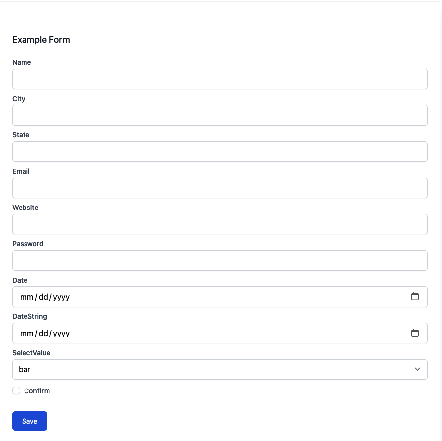

# typebox-form [WIP]

A dynamically generated and validated [TypeBox](https://github.com/sinclairzx81/typebox) driven form component.

## Overview

Specify a `TObject` schema and the component will render form inputs based on the schema type and other various [JSON Schema](https://json-schema.org/understanding-json-schema/index.html) properties. Features like input validation, full type safety, initial values, placeholders, and more are supported by specifying the correct properties.

Note that this also uses `preact`, `@preact/signals`, and `tailwindcss` because those are components in my standard stack and I don't plan on making it more generic at this time.

## Example

```tsx
const ExampleSchema = T.Object({
  name: T.String(),
  age: T.Number(),
  location: T.Object({
    city: T.String(),
    state: T.String(),
  }),
  email: T.String({ format: "email" }),
});

<TypeBoxForm title="Example Form" schema={ExampleSchema} />;
```

Has type safety with its `onFormSubmit` prop:


And will render a form like:



## TODO

- [ ] Add tests
- [ ] Make sub object schemas render a visible boundary between input groups (and maybe additional label?)
- [ ] Enum / Select support
- [ ] Checkbox input
- [ ] Support more formats / input types
- [ ] Proper install instructions / publish to npm
